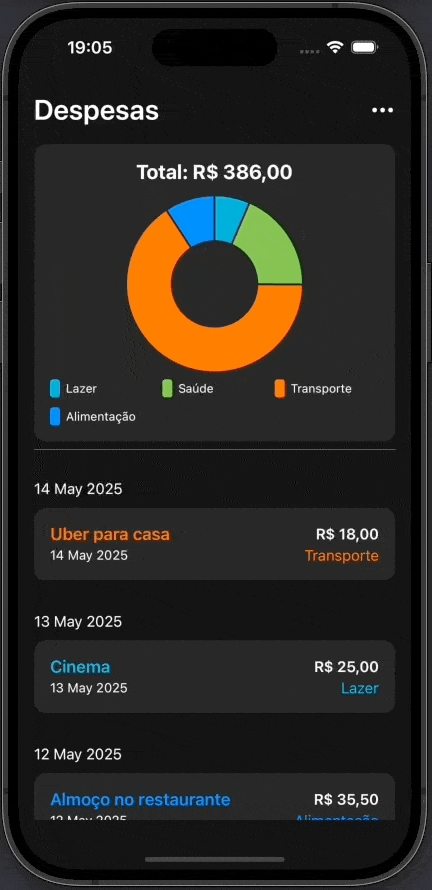
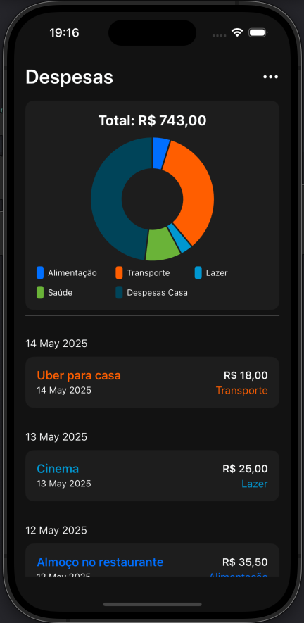

# 📊 Dashboard Gastos Pessoais SwiftUI / MVVM / Chart / CoreData

Projeto de um **app para controle de gastos pessoais** utilizando a arquitetura **MVVM** e interfaces implementadas com **SwiftUI**. Este projeto inclui:

✨ **Principais Funcionalidades**:
- Gráfico com separação por tipo de despesas implementado com **Chart**
- Persistência de dados local com **CoreData**;
- Arquitetura **MVVM** para separação de responsabilidades;
- Implementação de interfaces com **SwiftUI**;
- Implementação de componente TextField customizado para melhor apresentação na UI
- Utilização de bibliotecas nativas para manipulação de datas;
- Utilização de bibliotecas nativas para manipulação de cores;
- Extensions para formatação de datas, currency e conversão das cores para hexadecimal
- Mocks para visualização correta de previews;
- Estruturas (`structs`) customizadas;
- Adição e exclusão de despesas trabalhando com máscara de currency, e biliotecas nativas para datas;
- Adição de tipo de despesas podendo escolher a cor para o gráfico e melhor visualização na lista de despesas;
- Ação de exclusão da despesa com gesto nativo de **arrastar para o lado** em listas;
- Lista com despesas separadas por dia (Sections List)

## 🛠 Desenvolvido e testado com:
- **macOS** 15.4.1 Sequoia
- **Xcode** 16
- **iOs** 18 em um emulador de iPhone 16

## 📦 Dependências Externas
Este projeto **não possui dependências externas**, como web services. Basta rodar o projeto diretamente para utilizá-lo.

## 📸 Imagens

  
  

## 🚀 Como Rodar o Projeto
1. Abra o projeto no **Xcode**.
2. Selecione um simulador ou dispositivo real.
3. Execute o app clicando no botão **Run** ou usando o atalho `Cmd + R`.

## 📄 Licença

Copyright (c) 2025 Fernando Schulz

Permission is hereby granted, free of charge, to any person obtaining a copy of this software and associated documentation files (the "Software"), to deal in the Software without restriction, including without limitation the rights to use, copy, modify, merge, publish, distribute, sublicense, and/or sell copies of the Software, and to permit persons to whom the Software is furnished to do so, subject to the following conditions:

The above copyright notice and this permission notice shall be included in all copies or substantial portions of the Software.

THE SOFTWARE IS PROVIDED "AS IS", WITHOUT WARRANTY OF ANY KIND, EXPRESS OR IMPLIED, INCLUDING BUT NOT LIMITED TO THE WARRANTIES OF MERCHANTABILITY, FITNESS FOR A PARTICULAR PURPOSE AND NONINFRINGEMENT. IN NO EVENT SHALL THE AUTHORS OR COPYRIGHT HOLDERS BE LIABLE FOR ANY CLAIM, DAMAGES OR OTHER LIABILITY, WHETHER IN AN ACTION OF CONTRACT, TORT OR OTHERWISE, ARISING FROM, OUT OF OR IN CONNECTION WITH THE SOFTWARE OR THE USE OR OTHER DEALINGS IN THE SOFTWARE.
